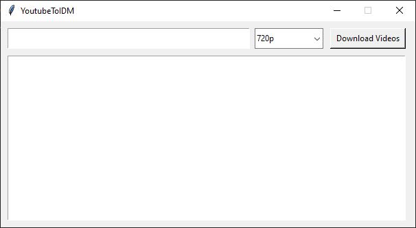

# YoutubeToIDM

This Python application, built with Tkinter and Pytube, extracts information from a YouTube playlist and saves the URLs of videos to a text file, with customizable quality options.

## Installation

1. Ensure you have Python installed on your system.
2. Clone this repository:  
   `git clone https://github.com/ahmedtijaninet/YoutubeToIDM.git`
3. Install the required dependencies:  
   `pip install pytube`

## Usage

1. Run the application by executing the `YoutubeToIDM.py` file:  
   `python YoutubeToIDM.py`
2. Enter the URL of the YouTube playlist you want to download videos from.
3. Select your preferred video quality from the dropdown menu.
4. Click on the "Download Videos" button.
5. A text file named `playlist.txt` will be created in the same directory containing the URLs of videos along with their titles.

## Features

* Extracts videos from a YouTube playlist with customizable quality options.
* Automatically selects the highest available quality if the requested quality is not available.
* Saves video URLs along with titles to a text file.
* Displays real-time progress and operation details in the application window.
* Simple and easy-to-use GUI.
* Screenshot of the GUI:
  

## New Updates

* Added a dropdown menu for selecting preferred video quality (360p, 480p, 720p, 1080p).
* Implemented a fallback mechanism to select the highest available quality if the requested quality is not available.
* Improved progress reporting, now showing the actual quality of each processed video.
* Enhanced error handling for cases where no suitable video format is found.

## Contributing

Contributions are welcome! If you find any issues or have suggestions for improvements, feel free to open an issue or create a pull request.

## License

This project is licensed under the MIT License - see the [LICENSE](LICENSE) file for details.
